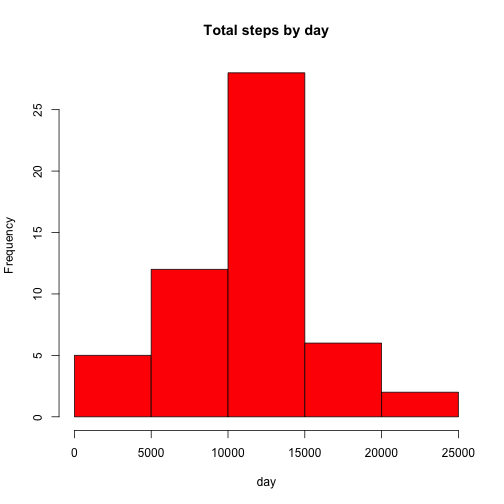
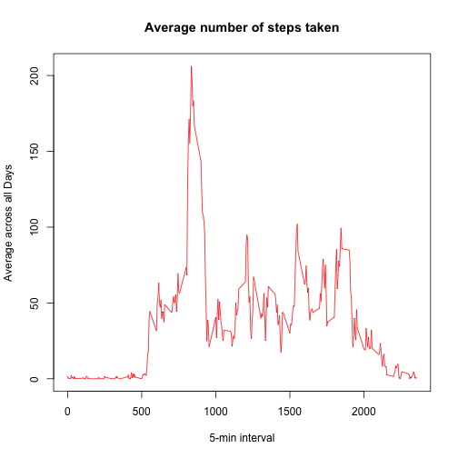
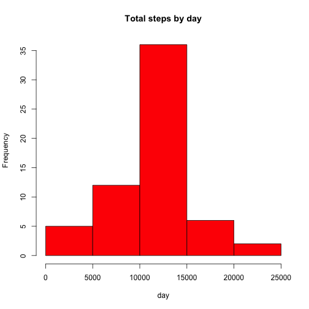

## Loading and preprocessing the data

```r
activity <- read.csv("activity.csv", colClasses = c("numeric", "character", "numeric"))
head(activity)
```

```
##   steps       date interval
## 1    NA 2012-10-01        0
## 2    NA 2012-10-01        5
## 3    NA 2012-10-01       10
## 4    NA 2012-10-01       15
## 5    NA 2012-10-01       20
## 6    NA 2012-10-01       25
```

```r
names(activity)
```

```
## [1] "steps"    "date"     "interval"
```

```r
library(lattice)
activity$date <- as.Date(activity$date, "%Y-%m-%d")
StepsTotal <- aggregate(steps ~ date, data = activity, sum, na.rm = TRUE)
```
## What is mean total number of steps taken per day?

```r
hist(StepsTotal$steps, main = "Total steps by day", xlab = "day", col = "red")
```

 

```r
mean(StepsTotal$steps)
```

```
## [1] 10766.19
```

```r
median(StepsTotal$steps)
```

```
## [1] 10765
```

## What is the average daily activity pattern?

```r
time_series <- tapply(activity$steps, activity$interval, mean, na.rm = TRUE)
plot(row.names(time_series), time_series, type = "l", xlab = "5-min interval", 
     ylab = "Average across all Days", main = "Average number of steps taken", 
     col = "red")
```

 

```r
max_interval <- which.max(time_series)
names(max_interval)
```

```
## [1] "835"
```
### Observations:
Based on steps taken pattern, the person's daily activity peaks around 8:35am.


## Imputing missing values

```r
activity_NA <- sum(is.na(activity))
activity_NA
```

```
## [1] 2304
```

```r
StepsAverage <- aggregate(steps ~ interval, data = activity, FUN = mean)
fillNA <- numeric()
for (i in 1:nrow(activity)) {
        obs <- activity[i, ]
        if (is.na(obs$steps)) {
                steps <- subset(StepsAverage, interval == obs$interval)$steps
        } else {
                steps <- obs$steps
        }
        fillNA <- c(fillNA, steps)
}

new_activity <- activity
new_activity$steps <- fillNA

StepsTotal2 <- aggregate(steps ~ date, data = new_activity, sum, na.rm = TRUE)
hist(StepsTotal2$steps, main = "Total steps by day", xlab = "day", col = "red")
```

 

```r
mean(StepsTotal2$steps)
```

```
## [1] 10766.19
```

```r
median(StepsTotal2$steps)
```

```
## [1] 10766.19
```
### Observations:

Do these values (mean and median) differ from the estimates from the first part of the assignment? Not Really.  

What is the impact of imputing missing data on the estimates of the total daily number of steps? The shape of the histogram remains the same as the histogram from removed missing values. However, the frequency counts increased as expected. In this case, it seems that the data imputation strategy should work for the downstream data analysis and modeling.

## Are there differences in activity patterns between weekdays and weekends?

```r
day <- weekdays(activity$date)
daylevel <- vector()
for (i in 1:nrow(activity)) {
        if (day[i] == "Saturday") {
                daylevel[i] <- "Weekend"
        } else if (day[i] == "Sunday") {
                daylevel[i] <- "Weekend"
        } else {
                daylevel[i] <- "Weekday"
        }
}
activity$daylevel <- daylevel
activity$daylevel <- factor(activity$daylevel)

stepsByDay <- aggregate(steps ~ interval + daylevel, data = activity, mean)
names(stepsByDay) <- c("interval", "daylevel", "steps")

xyplot(steps ~ interval | daylevel, stepsByDay, type = "l", layout = c(1, 2), 
       xlab = "Interval", ylab = "Number of steps")
```

 
### Observations:
Are there differences in activity patterns between weekdays and weekends? Yes. The plot indicates that the person moves around more (or more active) during the weekend days.


## Conclusion
In this assignment, it provided a step-by-step approach for analyzing data. The data analysis started from loading data, transform data including the strategy and implementation of dealing with missing data, and reporting statistical data and plots. The reader should be able to follow the document and reproduce the same results. The document was prepared with R version 3.0.2 on Mac OS X v10.10.3.
